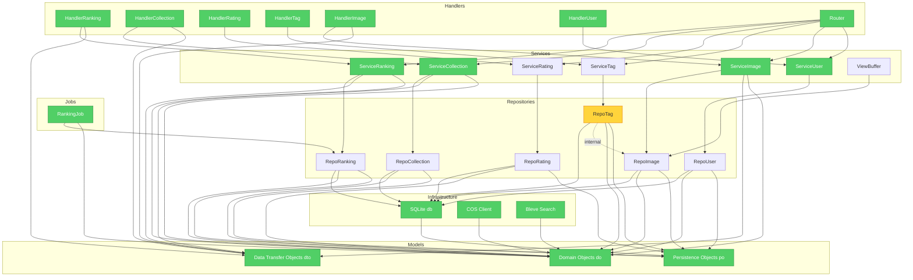

# Brooks-Lint — Architecture Audit

**Mode:** Architecture Audit
**Scope:** `internal/` package structure (handler, service, repository, job, model, infra)
**Health Score:** 72/100

Architecture follows clean hexagonal layout with clear layers, but exhibits repository-level service-to-repository dependency inversion violations and internal repository cross-dependency. Domain models maintain thin value objects with minimal behavior; service layer retains business logic.

---

## Module Dependency Graph

---

## Findings

### 🔴 Critical

**Dependency Disorder — Repository layer directly creates other repository instances**
Symptom: `internal/repository/tag.go:213` — `TagRepository.FindActiveImagesWithTags()` instantiates `NewImageRepository()` inside method body, bypassing dependency injection and creating hard dependency on image repository implementation
Source: Martin — Clean Architecture, Stable Dependencies Principle (SDP) — dependency inversion violated when concrete implementation is instantiated at runtime
Consequence: Repository layer no longer testable in isolation; changes to `ImageRepository` constructor arguments cascade into `TagRepository`; circular dependency risk if `ImageRepository` ever needs tag data; architecture seams break
Remedy: Inject `ImageRepository` via `TagRepository` constructor or context parameter; pass pre-configured repository instance down call chain; avoid ad-hoc instantiation

**Dependency Disorder — Service layer imports repository package directly**
Symptom: `internal/service/*.go` import `"github.com/yachiyo/acgwarehouse/internal/repository"` to define repository interfaces; this pulls GORM and persistence objects into service compilation unit
Source: Martin — Clean Architecture, Dependency Inversion Principle (DIP) — domain layer should define abstractions without importing infrastructure definitions
Consequence: Domain services compile-time dependent on repository package which imports `gorm.DB` and `po` structs; every service test transitively loads ORM; architecture port boundaries are leaky
Remedy: Define repository interfaces in `internal/infra/ports/` or keep in service package but with only pure domain types; inject GORM at handler/wiring boundary only; service layer should depend on abstractions, not implementations

### 🟡 Warning

**Domain Model Distortion — Domain objects contain behavior methods**
Symptom: `internal/model/do/image.go:68` — `Image.IsActive()` and `Image.NormalizeForCreate()` contain behavior, blurring domain object with validation logic; `internal/model/do/ranking.go:61` — `RankingPeriod.IsValid()` is pure behavior
Source: Evans — Domain-Driven Design, Domain Model pattern — domain objects should represent state and identity; behavior belongs in services or domain logic, not value objects
Consequence: Domain objects are no longer pure data; testing domain logic requires constructing full domain object state; behavior may diverge from service-layer rules; domain models become "fat" with validation side-effects
Remedy: Move validation/normalization to `internal/service/validators/` or service layer; keep domain objects as pure value types with zero behavior; if behavior needed, create dedicated `ImageValidator` or `RankingCalculator` component

**Change Propagation — Cross-repository internal dependencies create blast radius**
Symptom: `internal/repository/collection_item.go` functions (`applyFavoriteDelta`, `createFavoriteEvent`) modify `Image` favorite count and events; `internal/repository/tag.go` calls `ImageRepository`; these cross-module calls create coupling
Source: Ousterhout — A Philosophy of Software Design, Ch. 5: Information Hiding and Leakage — implementation details leak through cross-module calls
Consequence: Changing image event schema impacts both collection and tag repositories; testing one repository requires database fixtures for others; feature additions touch multiple repositories simultaneously
Remedy: Introduce `ImageEventRepository` dedicated interface; repositories should only depend on `ImageRepository` via explicit injection; isolate event handling to dedicated repository/service

**Accidental Complexity — Mapper files duplicate transformation logic**
Symptom: Each repository has `*_mapper.go` (e.g., `collection_mapper.go`, `tag_mapper.go`) manually converting between DO and PO with near-identical structure; 188 lines across 9 PO files and 275 lines across 6 DO files for essentially trivial transformations
Source: Fowler — Refactoring, Lazy Class — minimal-value abstraction that adds no distinct behavior
Consequence: Adding fields to domain or persistence models requires editing two mapper files; maintenance overhead disproportionate to value; duplication risk
Remedy: Use struct tag-based mapping (e.g., `copier` library, reflection-based mapper) or generate mapper functions; centralize mapping logic into `internal/model/mapper.go` utility

**Testability Seam Assessment — Missing seams at repository boundaries**
Symptom: Repository methods accept `*gorm.DB` as parameter; no interface abstraction allows test doubles; tests must use real SQLite database (`openTestDatabase(t)`) even for service-level unit tests
Source: Feathers — Working Effectively with Legacy Code, Ch. 4: The Seam Model — seam is place where behavior can be altered without editing source; absence of seams forces integration tests
Consequence: Unit tests are actually integration tests; test execution slower; cannot mock repository for service testing; database fixtures required for all tests
Remedy: Define repository interfaces (already exist in service layer) and have repositories implement them; introduce `RepositoryFactory` or DI container to inject test doubles; handler tests should not need database

### 🟢 Suggestion

**Cognitive Overload — Module fan-out elevated in service layer**
Symptom: `internal/service/image.go` imports repository, search, view buffer, DTO, DO, logger, COS base — 7+ direct dependencies; service constructors have multiple parameter lists
Source: McConnell — Code Complete, Ch. 7: High-Quality Routines — parameter list and import count signal complexity
Consequence: Adding new dependency to image service requires editing constructor and tests; service instantiation is complex; developer mental load high
Remedy: Consolidate dependencies into `ImageDependencies` struct or builder; reduce service parameters to essential collaborators; use dependency container pattern

**Knowledge Duplication — Repository interface definitions duplicated in service layer**
Symptom: Each service file defines its own repository interface (e.g., `CollectionRepository` in `collection.go:22`, `TagRepository` in `tag.go:25`); interfaces are not shared across services
Source: Hunt & Thomas — The Pragmatic Programmer, DRY: Don't Repeat Yourself — same decision (repository contract) expressed in multiple places
Consequence: Changing repository method signature requires editing multiple service interface definitions; test mocks duplicated; contract maintenance cost
Remedy: Centralize repository interfaces in `internal/ports/repositories.go` or shared interface package; services import from common location; reduce duplication to single definition

---

## Summary

Backend architecture demonstrates clean hexagonal separation with clear handler → service → repository → infrastructure flow. Domain models remain largely anemic (value objects) which is appropriate for CRUD-heavy workflows. Primary architectural risks: 1) repository-layer internal dependency creation bypassing DI (`TagRepository` creates `ImageRepository`), 2) service-layer importing repository package which transitively pulls ORM dependencies into domain layer. Recommended remediation: introduce repository interfaces in dedicated ports package, inject GORM at wiring boundary only, avoid runtime repository instantiation. Testability seam assessment reveals missing abstraction at repository boundaries — tests require real database. Conway's Law check skipped (team structure unknown). Overall architecture is sound but needs dependency inversion cleanup to achieve testable module isolation.