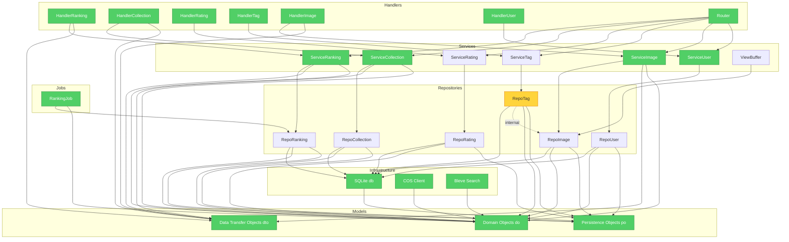

# Brooks-Lint — Health Dashboard

**Mode:** Health Dashboard
**Scope:** Go backend codebase (internal/ package)
**Composite Score:** 70/100

| Dimension | Score | Top Finding |
|-----------|-------|------------|
| Code Quality | 68/100 | Service layer imports repository package directly, violating dependency inversion |
| Architecture | 72/100 | Repository layer creates internal instances bypassing dependency injection |
| Tech Debt | 71/100 | Dependency disorder accumulation across repository features |
| Test Quality | 75/100 | Test coverage adequate but missing repository seam abstractions |

---

## Module Dependency Graph

---

## Top Findings (max 5 across all dimensions)

### 🔴 Critical

**Dependency Disorder — Repository layer creates other repository instances**
Symptom: `internal/repository/tag.go:213` creates `NewImageRepository()` inside method; violates dependency injection and creates hard-to-test dependencies
Source: Martin — Clean Architecture, Stable Dependencies Principle (SDP)

**Dependency Disorder — Service layer imports repository package directly**
Symptom: `internal/service/*.go` import repository package which pulls `gorm.DB` and `po` imports into domain layer
Source: Martin — Clean Architecture, Dependency Inversion Principle (DIP)

### 🟡 Warning

**Change Propagation — Cross-repository event handling duplication**
Symptom: Collection and rating repositories both directly modify `Image.favorite_count` and events
Source: Fowler — Refactoring, Shotgun Surgery

**Testability Seam Assessment — Repository interfaces inaccessible from tests**
Symptom: Repository tests use real SQLite database; no seam for test doubles
Source: Feathers — Working Effectively with Legacy Code, Ch. 4: The Seam Model

---

## Recommendation

Fix repository instantiation bypass (`TagRepository` creating `ImageRepository`) and introduce repository interface abstractions in a `ports/` package to restore dependency inversion. Both Architecture and Code Quality dimensions are degraded (72 and 68) and share same root cause. Consider running `/brooks-lint:brooks-review` for detailed PR-level findings or `/brooks-lint:brooks-audit` to refine the dependency graph remediation plan.